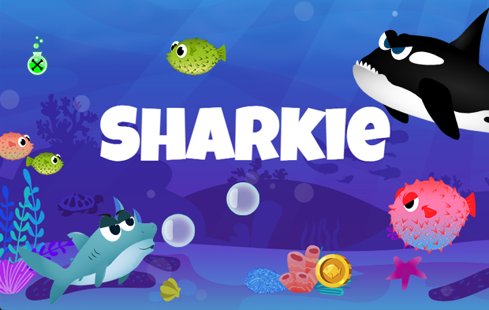

# Sharkie
Sharkie is a simple jump-and-run game based on an object-oriented approach. Check out the [live-version](https://maik-kempe.de/sharkie/index.html) on my private homepage.

## Getting Started

### Requirements

- A modern browser, preferably [Google Chrome](https://www.google.com/chrome/)
- For developers: a modern IDE

### Run the game

- Download the .zip file of the repository or clone it with the following command: `git clone git@github.com:MaikKempe/Sharkie.git`

- Open the folder and start the index.hmtl in your browser.

## License
- The source code is licensed under the MIT License - see the [LICENSE](LICENSE) file for details
- The copyright for all graphics and images belongs to [Developer Akademie](https://developerakademie.com/).

## Acknowledgments
- This is a private project and was created in order to improve my skills in object-oriented programming with JavaScript
- Please feel free to send me any comment, suggestion or correction you may have.
